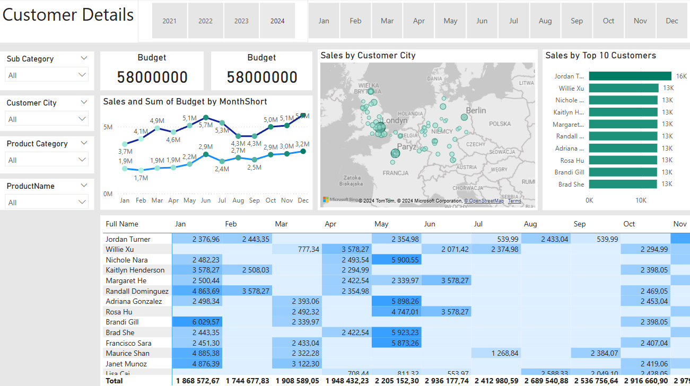

### Data Analyst Portfolio Project – Sales Management

### Wymagania użytkownika
W ramach tego projektu analizy danych, biznesowym celem było stworzenie raportu sprzedażowego dla kadry menedżerskiej. 
Na podstawie otrzymanego zapotrzebowania zdefiniowano następujące historie użytkowników, aby zapewnić pomyślną realizację oraz utrzymanie wszystkich kryteriów akceptacji przez cały czas trwania projektu.

### Czyszczenie i transformacja danych (SQL)
Aby stworzyć niezbędny model danych do analizy oraz spełnienia wymagań biznesowych zdefiniowanych w historiach użytkowników, wyodrębniono poniższe tabele przy użyciu SQL.
Jedno ze źródeł danych (budżety sprzedaży) dostarczono w formacie Excel, a jego połączenie z modelem danych nastąpiło na późniejszym etapie procesu.
Poniżej znajdują się instrukcje SQL służące do czyszczenia i transformacji niezbędnych danych.
### DIM_Calendar:

### DIM_Customers:

### DIM_Products:

### FACT_InternetSales:

### Data Model
Poniżej znajduje się zrzut ekranu modelu danych po załadowaniu oczyszczonych i przygotowanych tabel do Power BI.
Model danych pokazuje również, w jaki sposób tabela FACT_Budget została połączona z FACT_InternetSales oraz innymi niezbędnymi tabelami wymiarów (DIM).

### Podsumowanie 
Gotowy pulpit zarządzania sprzedażą zawiera jedną stronę pełniącą funkcję dashboardu i przeglądu, oraz dwie dodatkowe strony skupiające się na łączeniu tabel, aby dostarczyć niezbędnych szczegółów i wizualizacji przedstawiających sprzedaż w czasie, według klientów oraz według produktów.

### Zapraszam do pobrania pliku projektowego i wypróbowania dashboardu w Power Bi!  
Możesz pobrać plik [tutaj](project.pbix)

